# **Bike-X**

## Start-X 

###### UnB, Setembro de 2014

Slides disponíveis [aqui](http://start-x.github.io/relatorio) 

.notes: Pressing 2 will display these fascinating notes

.fx: titleslide

# presenter notes
Some notes go here including this list:

* one
* two
* three

And this final line.

---
 

# Agenda

  - Oportunidades
  - Requisitos do Produto
  - Integração entre as Engenharias
  - Gerenciamento do Projeto
  - EAP
  - Custo

--------------- 

# Oportunidades

-----

### Ócio
<figure>
    
    <!-- <figcaption>Caption goes here</figcaption> -->
</figure>

# presenter notes
 - Dia-a-dia exige cada vez menos do corpo humano
 - Doenças: obesidade, diabetes, hipertensão

-------

### Conforto

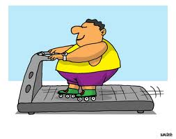

# presenter notes
 - Alimentação balanceada
 - Prática de exercícios físicos

-------

### Estrutura

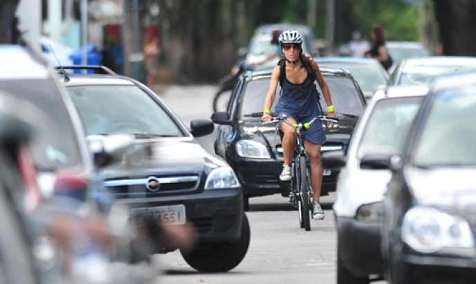

# presenter notes
 - Não existe estrutura na maioria das cidades
 - Perigo andar de bicicleta

-------

### Segurança

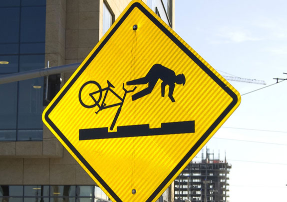

# presenter notes
 - Muitos acidentes nas grandes cidades

--------

# Requisitos do Produto

------

### Tela de apresentação

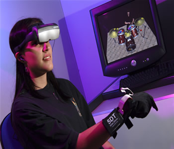

# presenter notes
 - Virtualizar um ambiente real
 
---------

### Feedback

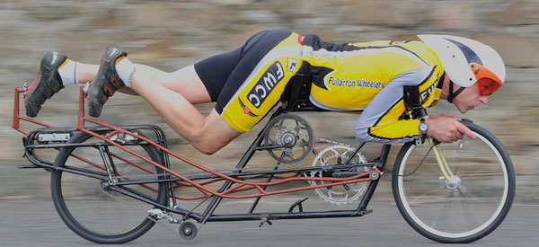

# presenter notes
 - Poder acelerar e desacelerar a bicicleta

---------

### Interação com o ambiente virtual

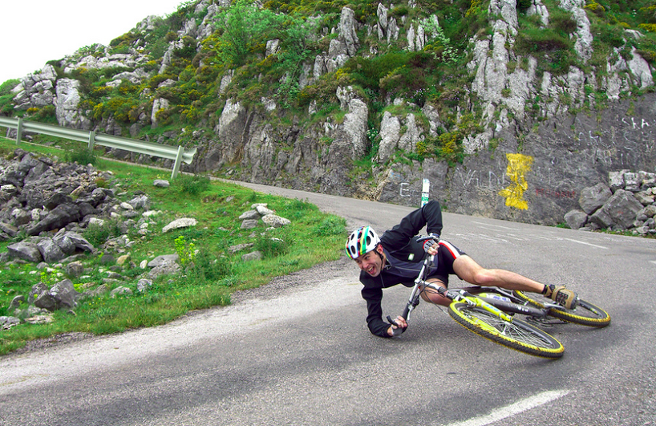

# presenter notes
 - Poder fazer curvas com a bicicleta

---------

### Integração com realidade

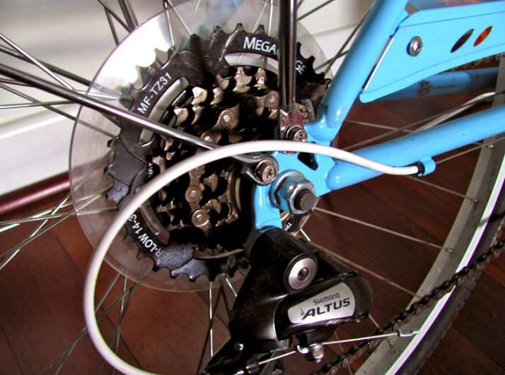

# presenter notes
 - Trocar marchas da bicicleta

---------

### Retorno energético

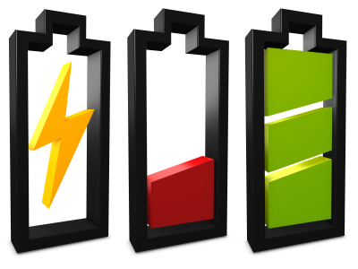 

# presenter notes
 - Recarregar bateria de um dispositivo móvel de escolha do usuário

---------

### Interação com o usuário

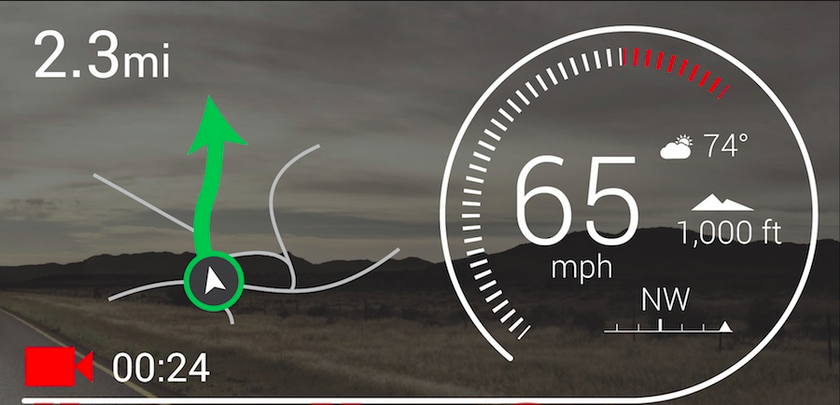

# presenter notes
  - Apresentar informações para o usuário
    - velocidade virtual
    - distância percorrida
    - batimentos cardíacos por minuto
    - quantidade de calorias gastas
    - tempo gasto
    - quantidade energia gerada

---------

## Integração entre as Engenharias

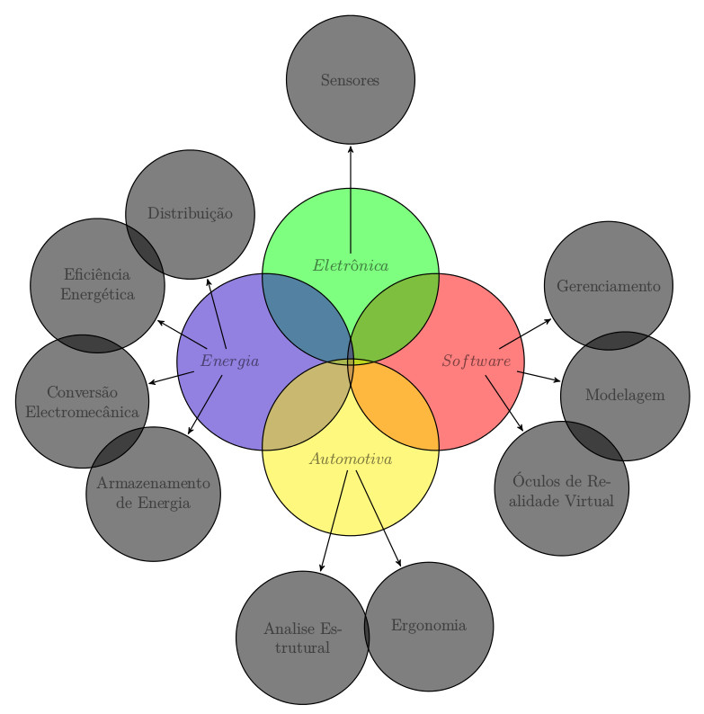

.notes: 
# presenter notes
 - Software e Eletrônica
    - processamento de dados
 - Eletrônica e Energia
    -  condicionamento
 - Energia e Automotiva
    - acoplamento da fonte
 - Automotiva e Software
    - feedback mecânica

---------

# Gerenciamento do Projeto

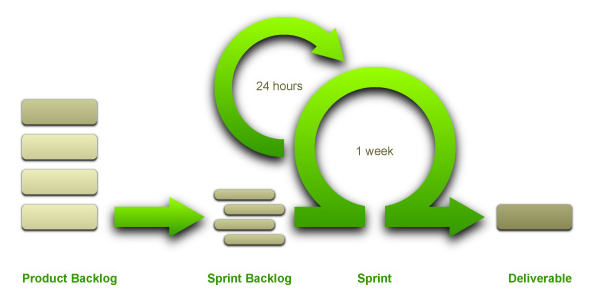

# presenter notes
   - interativo
   - pequenos entregáveis em todas as sprints
   - Sprints e backlog
   - time auto organizável
   - aberto a mudanças

----------

# Redmine

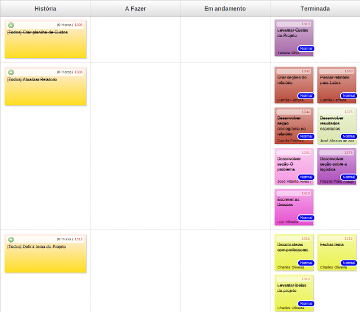

# presenter notes
   - plugin backlogs
   - contabilizar horas
   - gerenciamento e delegação de tarefas
   - status do andamento das atividades
   - métricas de gerenciamento de projeto

----------

# EAP

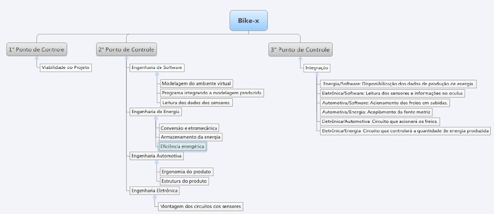

----------

# Custos

<table border="2" class="tg">
  <tr>
    <th class="tg-031e">Engenharia</th>
    <th class="tg-031e">Custo</th>
  </tr>
  <tr>
    <td class="tg-031e">Automotiva</td>
    <td class="tg-031e">R$ 418,00</td>
  </tr>
  <tr>
    <td class="tg-031e">Eletrônica</td>
    <td class="tg-031e">R$ 367,00</td>
  </tr>
  <tr>
    <td class="tg-031e">Energia </td>
    <td class="tg-031e">R$ 564,00</td>
  </tr>
  <tr>
    <td class="tg-031e">Software </td>
    <td class="tg-031e">R$ 1500,00</td>
  </tr>
  <tr>
    <td class="tg-e3zv">Total</td>
    <td class="tg-e3zv">R$ 2849,00</td>
  </tr>
</table>

---------

# Dúvidas?

