# **Bike-X**

## Start-X

  

###### UnB, 31 de Outubro de 2014

Slides disponíveis [aqui](http://start-x.github.io/relatorio) 

-------

# Integrantes

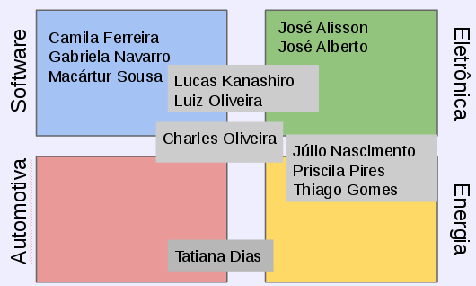

------

# Agenda

- Relembrando o Bike-X
- Desenvolvimento
    - Energia
    - Automotiva
    - Eletrônica
    - Software
- 3º Ponto de Controle

----------

# Agenda - Energia
- Levantamento das Cargas
- Fonte para Conversão Eletromecânica de Energia
- Bateria
- Condutores e Conduíte
- Dispositivo de Proteção do Circuito
- Circuitos de Alimentação das Cargas
- Esquema 2D do Circuito

----------

# Levantamento das cargas

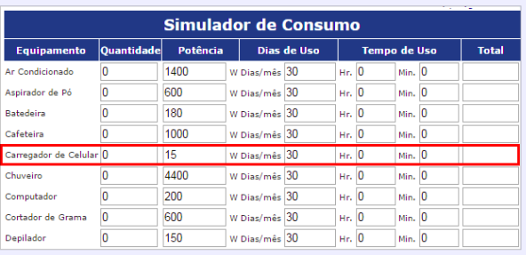

-----

# Levantamento das cargas

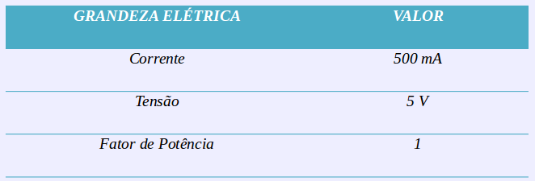

-----

# Levantamento das cargas

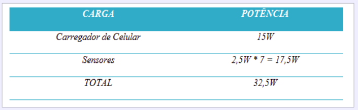

-----

# Fonte para Conversão Eletromecânica de Energia

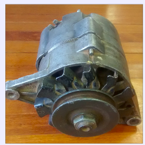

-----

# Fonte para Conversão Eletromecânica de Energia

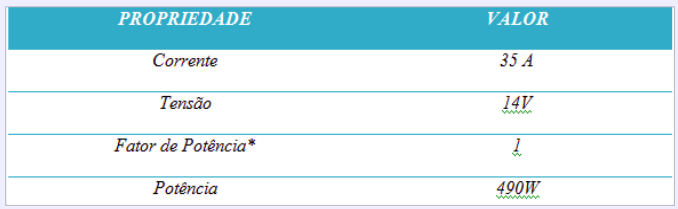

-----

# Bateria

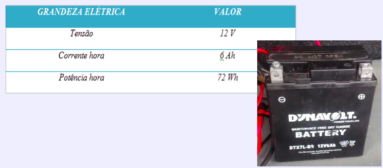

-------

# Condutores

Orientações ABNT NBR 5410:2004

Métodos Escolhidos:

- Capacidade da Condução de Corrente
- Queda de Tensão
- Seção Mínima

-------

# Condutores

Resultados (PVC; condutor metálico isolado; Iproj.)

- Capacidade da Condução de Corrente: 6 mm2
- Queda de Tensão: 4 mm2
- Seção Mínima: 0,75 mm2

-------

# Dispositivos de Proteção do Circuito

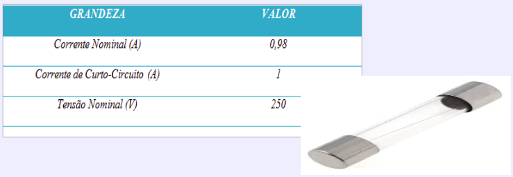

------

# Circuitos de Alimentação das Cargas

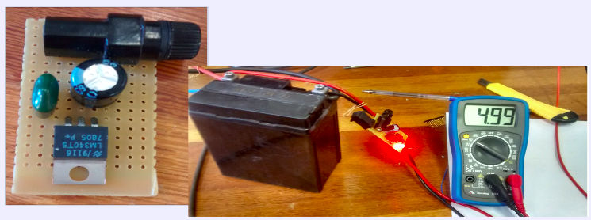

-----

# Esquema 2D do Circuito

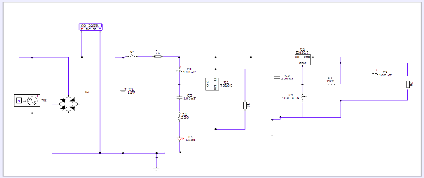

-----

# Agenda - Automotiva

- Definições
- Definição Geométrica da Estrutura
- Teoria das Falhas
- Distribuição de Forças
- Análise Estrutural

-----

# Definições

- Definição do percentil do usuário (100Kg)
- Escolha do material usado no perfil da estrutura (Aço 1010)
  - Tensão de Escoamento 325MPa
  - E = 200GPa

------

# Definição Geométrica da Estrutura

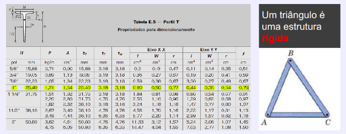

------

# Teoria das Falhas

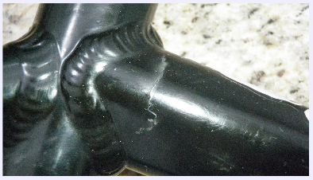

------

# Distribuição de Forças

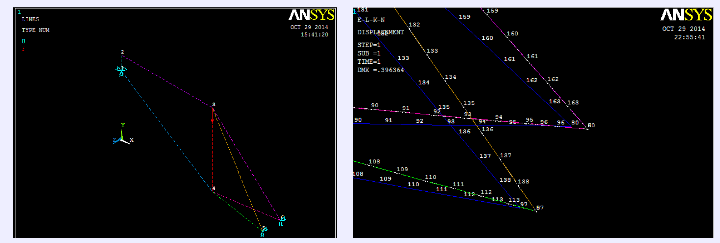
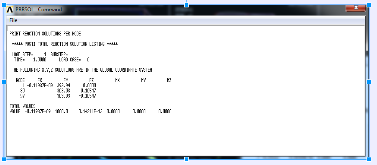

-------

# Análise Estrutural do Suporte (Von Misses)

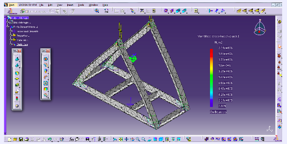

------

# Suporte

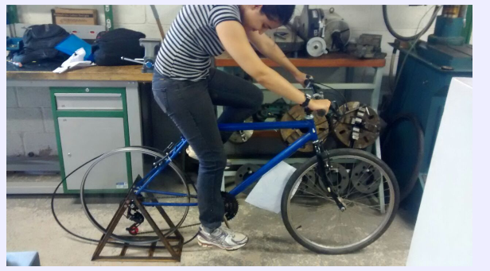

-------

# Agenda - Eletrônica

- Eletrônica Embarcada
  - Sensores empregados
  - Atuador do freio
  - Comunicação com o PC
- Plataforma de Microcontrolador
- Suportes dos Sensores na Bicicleta

-------

# Visão Sistêmica da Eletrônica Embarcada

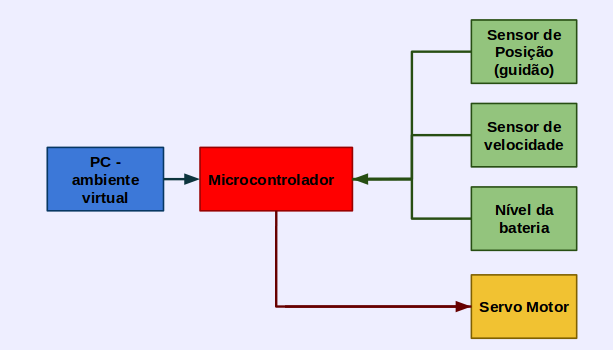

------

# Plataforma launchpad

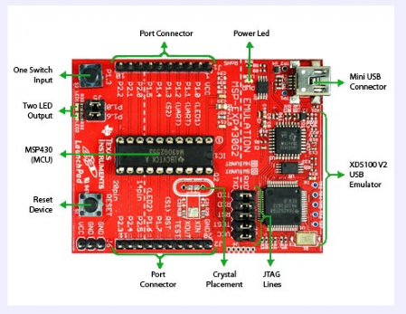

-------

# Suporte do sensor de velocidade

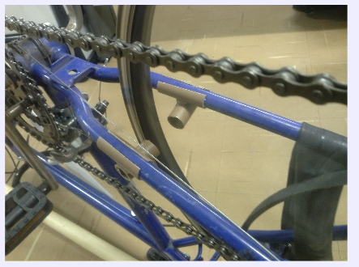

------

# Suporte do atuador do freio

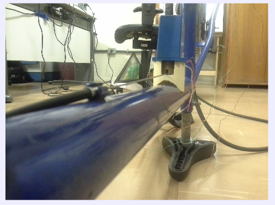

-------

# Agenda - Software

- Arquitetura do Sistema
- Comunicação com Sensores
- Ambiente Virtual
- Oculus Rift 
- Gestão de Configuração

------

# Diagrama de Classes - Bike-X

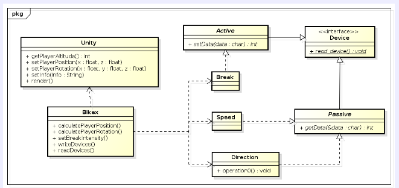

------

# Diagrama de Classes - Comunication

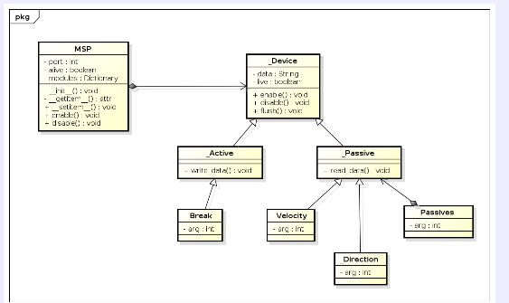

-------

# Comunicação com Sensores

- Scripts Python
- Biblioteca pySerial

--------

# Ambiente Virtual: Unity

Unity pode gerar builds para 16 sistemas operacionais distintos

--------

# Ambiente Virtual

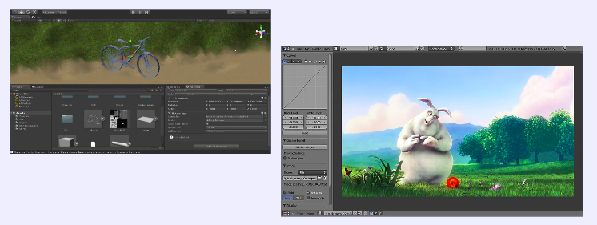

-------

# Ambiente Virtual - Mapa

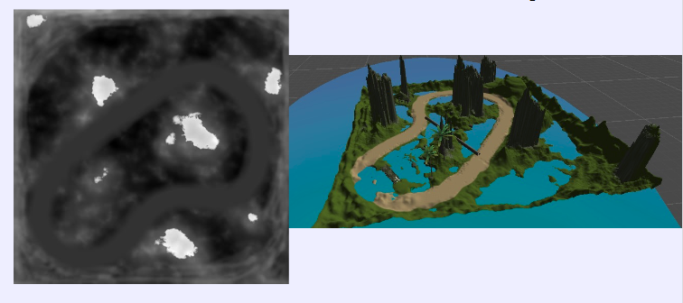

--------

# Ambiente Virtual - Modelos

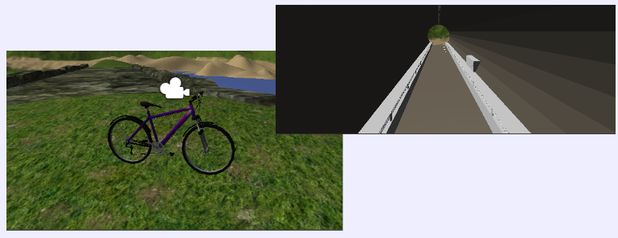

--------

# Ambiente Virtual - Modelos

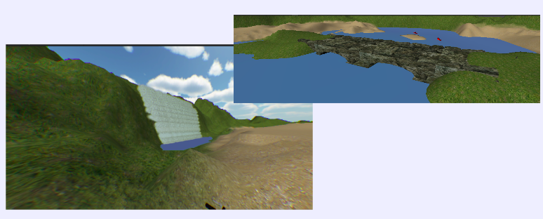

---------

# Simulação Virtual

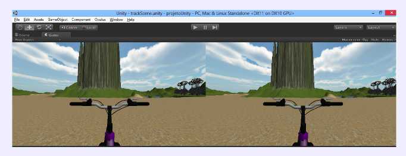

----------

# Modelagem Virtual - Scripts

Para criar ambientes virtuais no Unity usando SDK-OVR:

- Plugin Oculus Rift
- C#
- JavaScript

-----------

# Oculus Rift

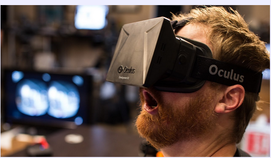

-------

# Coordenadas do Rift

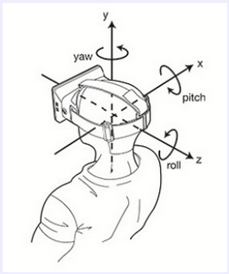

--------

# Distorção da Almofada

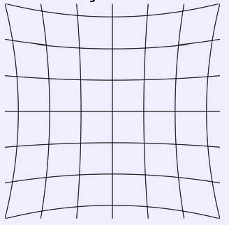

---------

# Distorção de Barril

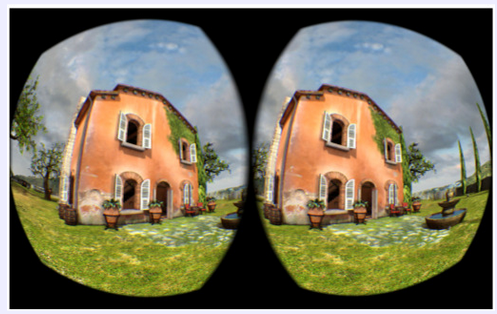

--------

# Gestão de Configuração

Dificuldade de manter a mesma configuração do ambiente de desenvolvimento

---------

# 3º Ponto de Controle

- Fixação do alternador
- Sincronização dos sensores
- Calibração dos dados
- Versão final do parque virtual

-----------

 

# Dúvidas?!
