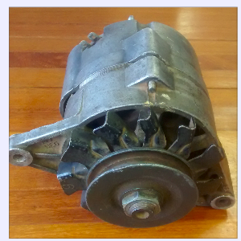

# **Bike-X**

## Start-X

  

###### UnB, 5 de Dezembro de 2014

Slides disponíveis em [http://start-x.github.io/relatorio](http://start-x.github.io/relatorio) 

-------

# Agenda
- O que é o Bike-X? 
- O que queremos resolver?
- Pra quem?
- Marketing
- Quanto custa pra desenvolver?
- Concorrentes? Obstáculos?
- Desenvolvimento
- Conclusão
----------

# O que é o Bike-X?

Já imaginou poder andar de bicicleta em qualquer lugar sem sair de sua sala de estar?

<!--  -->

----------

# O que queremos resolver?
-----

# Pra quem?
-----

# Marketing
-----

# Quanto custa pra desenvolver?

<table border="2" class="tg" style="width:70%">
  <caption>Custo com equipamentos e Materiais</caption>
  <tr>
    <th class="tg-031e">Engenharia</th>
    <th class="tg-031e">Custo</th>
  </tr>
  <tr>
    <td class="tg-031e">Automotiva</td>
    <td class="tg-031e">R$ 418,00</td>
  </tr>
  <tr>
    <td class="tg-031e">Eletrônica</td>
    <td class="tg-031e">R$ 367,00</td>
  </tr>
  <tr>
    <td class="tg-031e">Energia </td>
    <td class="tg-031e">R$ 564,00</td>
  </tr>
  <tr>
    <td class="tg-031e">Software </td>
    <td class="tg-031e">R$ 1500,00</td>
  </tr>
  <tr>
    <td class="tg-e3zv">Total</td>
    <td class="tg-e3zv">R$ 2849,00</td>
  </tr>
</table>

-----

# Concorrentes? Obstáculos?
-------

# Desenvolvimento
- Fluxo de trabalho
- Tecnologias utilizadas
- Dificuldades técnicas
-------

# Fluxo de trabalho
</img>
-------

# Tecnologias utilizadas
-------

# Dificuldades ténicas
-------

# Conclusão
- Melhora significativa da experiência do usuário na prática de atividade física
- Reprodutibilidade do projeto
- Boa interação entre todas as áreas
- Bom nível técnico da equipe
- Protótipo finalizado com sucesso \o/
------

# Próximos Passos
- Aumentar modularização
- Adicionar mais sensores
- Melhorar design do produto
- Adicionar novos ambientes virtuais
- Modificar base para ser móvel
------

# Dúvidas?!

