# **Bike-X**

<h2 style = "font-size: 40px"> Start-X</h2>

  

<h6 style = "font-size: 25px"> UnB, 5 de Dezembro de 2014 </h6>

Slides disponíveis em [http://start-x.github.io/relatorio](http://start-x.github.io/relatorio) 

-------

# Agenda
<ul> 
<li style = "font-size: 30px"> O que é o Bike-X? </li>
<li style = "font-size: 30px"> O que queremos resolver?</li>
<li style = "font-size: 30px"> Pra quem?</li>
<li style = "font-size: 30px"> Marketing</li>
<li style = "font-size: 30px"> Quanto custa pra desenvolver?</li>
<li style = "font-size: 30px">  Concorrentes? Obstáculos?</li>
<li style = "font-size: 30px">  Desenvolvimento</li>
<li style = "font-size: 30px"> Conclusão</li>
</ul>
----------

# O que é o Bike-X?

Já imaginou poder andar de bicicleta em qualquer lugar sem sair de sua sala de estar?

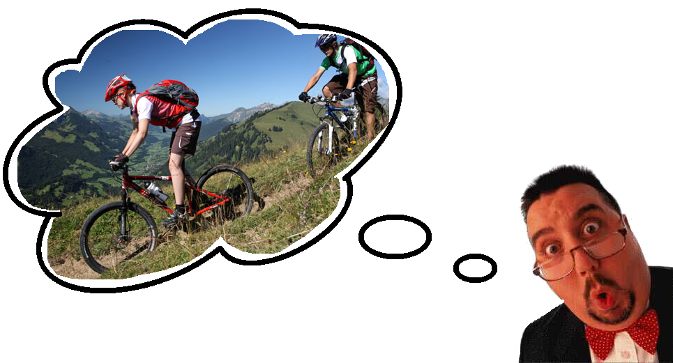

----------

# O que queremos resolver?
  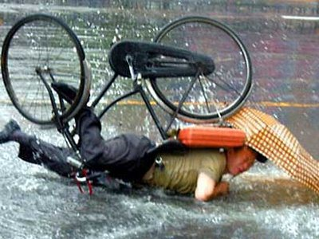
  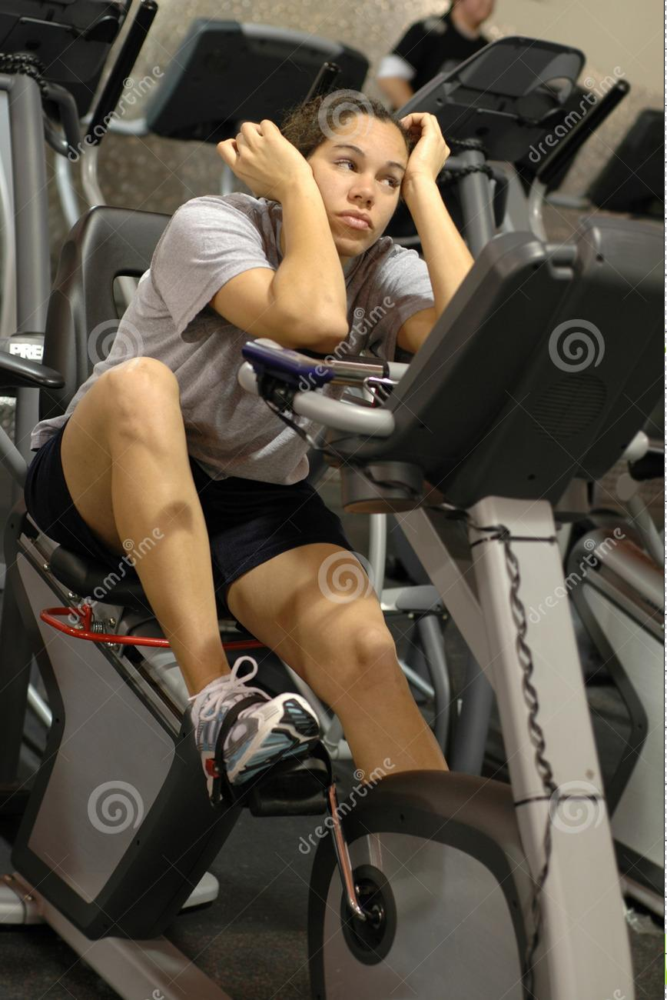
  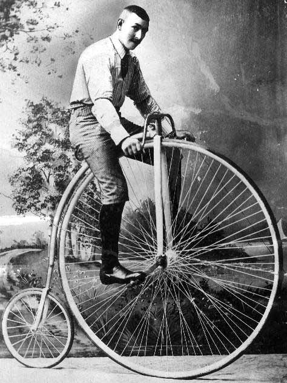

-----

# Pra quem?
  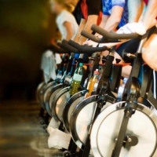
  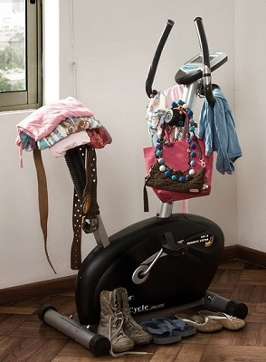
-----

# Marketing
-----

# Quanto custa pra desenvolver?

<table border="2" class="tg" style="width:40%; float: left; margin-top: 50px; font-size: 20px; margin-left: 50px">
  <caption>Custo com equipamentos e Materiais</caption>
  <tr>
    <th class="tg-031e">Engenharia</th>
    <th class="tg-031e">Custo</th>
  </tr>
  <tr>
    <td class="tg-031e">Automotiva</td>
    <td class="tg-031e">R$ 418.00</td>
  </tr>
  <tr>
    <td class="tg-031e">Eletrônica</td>
    <td class="tg-031e">R$ 367.00</td>
  </tr>
  <tr>
    <td class="tg-031e">Energia </td>
    <td class="tg-031e">R$ 564.00</td>
  </tr>
  <tr>
    <td class="tg-031e">Software </td>
    <td class="tg-031e">R$ 1,500.00</td>
  </tr>
  <tr>
    <td class="tg-e3zv">Total</td>
    <td class="tg-e3zv">R$ 2,849.00</td>
  </tr>
</table>

<table border="2" class="tg" style="width:70% position: relative; float: right; margin-top: 0px; margin-left: 20px; font-size: 18px">
  <!-- <caption>Custo com equipamentos e Materiais</caption> -->
  <tr>
    <th class="tg-031e">Horas trabalhadas por pessoa</th>
    <th class="tg-031e">Valor por pessoa</th>
  </tr>
  <tr>
    <td class="tg-031e">96h</td>
    <td class="tg-031e">R$ 1,080.00</td>
  </tr>
  <tr>
    <td class="tg-e3zv">Total</td>
    <td class="tg-e3zv">R$ 12,960.00</td>
  </tr>
</table>

<table border="2" class="tg" style="width:60%; float: center right; margin-top: 400px;font-size: 20px">
  <!-- <caption>Custo com equipamentos e Materiais</caption> -->
  <tr>
    <th class="tg-031e">Tipo do Custo</th>
    <th class="tg-031e">Valor</th>
  </tr>
  <tr>
    <td class="tg-031e">Equipamentos/ materiais</td>
    <td class="tg-031e">R$ 2,849.00</td>
  </tr>
  <tr>
    <td class="tg-031e">Pessoal</td>
    <td class="tg-031e">R$ 12,960.00</td>
  </tr>
  <tr>
    <td class="tg-e3zv">Total</td>
    <td class="tg-e3zv">R$ 15,809.00</td>
  </tr>
</table>

-----

# Concorrentes? Obstáculos?
  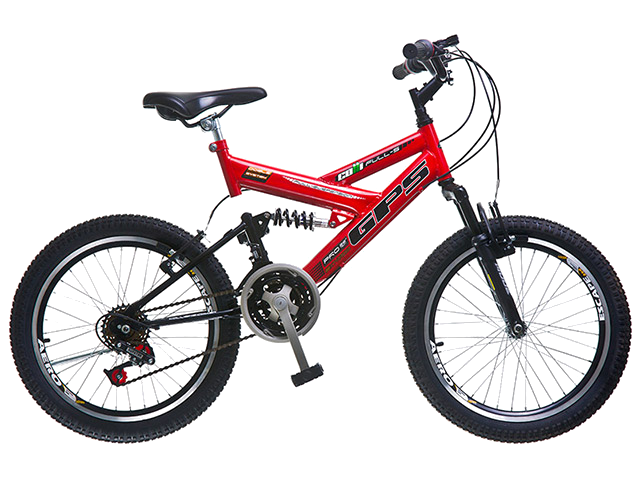
  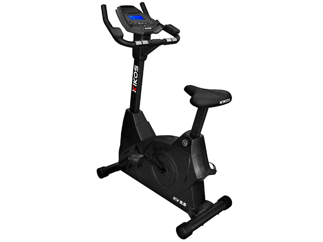
  
-------

# Desenvolvimento
<ul>
  <li style = "font-size: 30px;"> Fluxo de trabalho </li>
  <li style = "font-size: 30px;"> Tecnologias utilizadas </li>
  <li style = "font-size: 30px;"> Dificuldades técnicas </li>
</ul>
-------

# Fluxo de trabalho
  
  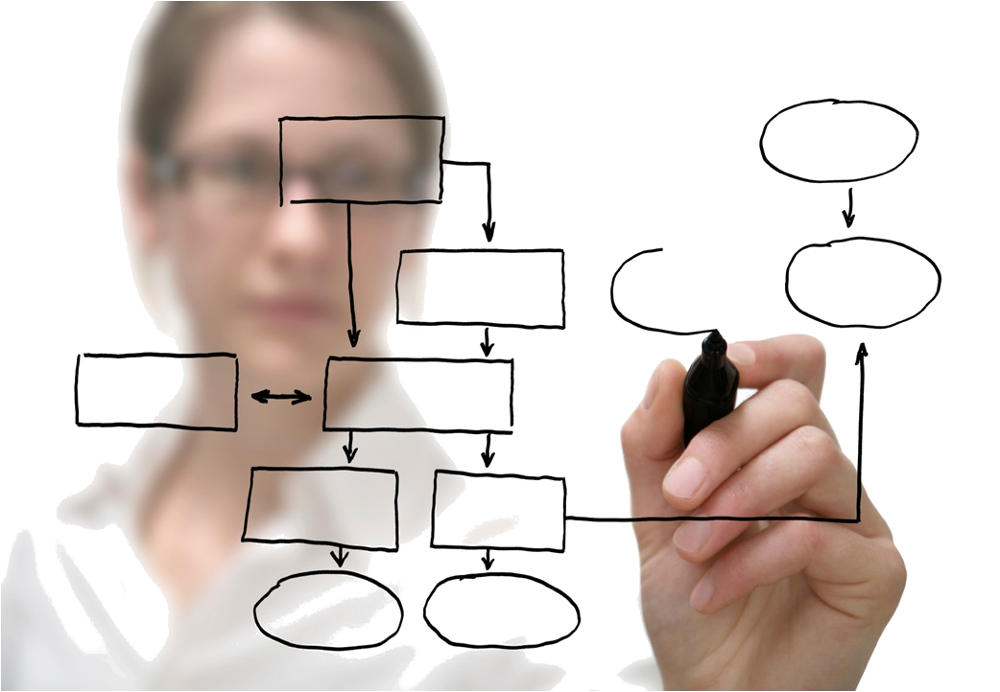
-------

# Tecnologias utilizadas
  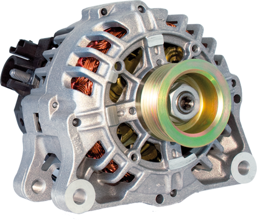
  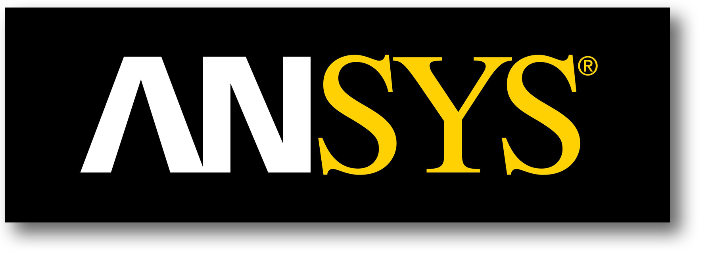
  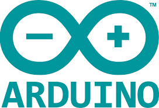
  
  
  
  
  
  
  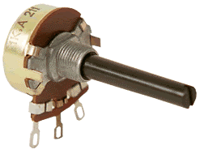
  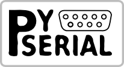
  
  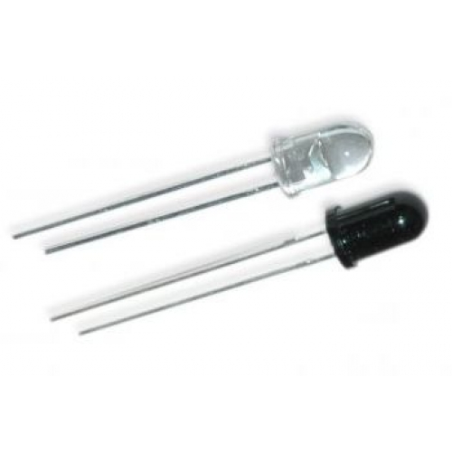
  
  
  
  
  
  

-------

# Dificuldades técnicas
<ul>
  <li style = "font-size: 30px"> Scripts do Unity 3D </li>
  <li style = "font-size: 30px"> MSP430 </li>
  <li style = "font-size: 30px"> Alternador </li>
</ul>
-------

# Conclusão
<ul>
  <li style = "font-size: 30px;"> Melhora significativa da experiência do usuário na prática de atividade física
  <li style = "font-size: 30px"> Reprodutibilidade do projeto </li> 
  <li style = "font-size: 30px"> Boa interação entre todas as áreas </li>
  <li style = "font-size: 30px"> Bom nível técnico da equipe </li>
  <li style = "font-size: 30px">  Protótipo finalizado com sucesso \o/ </li>
</ul>
------

# Próximos Passos
<ul>
  <li style = "font-size:30px"> Aumentar modularização </li>
  <li style = "font-size:30px"> Adicionar mais sensores </li>
  <li style = "font-size:30px"> Melhorar design do produto </li>
  <li style = "font-size:30px"> Adicionar novos ambientes virtuais </li>
  <li style = "font-size:30px"> Modificar base para ser móvel </li>
</ul>
------

# Dúvidas?!

-----

<embed  type="application/x-vlc-plugin" pluginspage="http://www.videolan.org" version="VideoLAN.VLCPlugin.2"   width="60%"        height="95%" id="vlc" loop="yes" autoplay="yes" target="rtp://@192.168.1.151:5004"  style="float: right"></embed>

